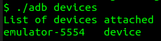
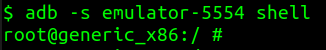

# Android Debug Bridge (ADB)

## 1. Installation

1. Download the SDK Platform-Tools for Windows / Mac / Linux from [developer.android.com](https://developer.android.com/studio/releases/platform-tools.html)
2. Unzip the downloaded file

        $ unzip platform-tools_r29.0.6-linux.zip

3. Navigate into the `platform-tools` folder and open a terminal window pointing to this location
4. Run the following command to see a list of available ADB options

        $ ./adb

## 2. Common ADB Commands

1. To see a list of **connected devices**

        $ ./adb devices

    

2. To get **shell access** to a connected device

        $ ./adb -s emulator-5554 shell

    

3. To **install** an application on a connected device

        $ ./adb -s emulator-5554 install APK_NAME.apk

4. To **copy** a file or a directory from the Android device into your local system

        $ ./adb pull /remote/path/on/connected/device /local/path/on/host

5. To **push** a file or a directory into the Android device

        $ ./adb pull /local/path/on/host /remote/path/on/connected/device

6. To view the **logs**

        $ ./adb logcat

## References

* [https://developer.android.com/studio/releases/platform-tools.html](https://developer.android.com/studio/releases/platform-tools.html)