# Drozer

- [Drozer](#drozer)
  - [1. Installation](#1-installation)
    - [Drozer Agent](#drozer-agent)
    - [Drozer Console](#drozer-console)
  - [2. Start Drozer Server](#2-start-drozer-server)
  - [3. Connect Drozer Console to Agent](#3-connect-drozer-console-to-agent)
  - [4. Common Drozer Commands](#4-common-drozer-commands)
  - [5. Solve It](#5-solve-it)
  - [References](#references)

Drozer has two components. A **drozer agent** will be installed on the Android emulator and it will be used to start the drozer server within Android emulator. A **drozer Console** will be installed on the local system where ADB is running.

## 1. Installation

### Drozer Agent

1. Download the latest Drozer Agent [here](https://github.com/mwrlabs/drozer/releases/download/2.3.4/drozer-agent-2.3.4.apk).
2. Install Drozer Agent in your Android Virtual Device

        $ adb install drozer-agent-2.x.x.apk

    

3. Start the Drozer Agent by clicking on the corresponding icon in Android emulator

    

4. By default, the embedded server is turned `OFF`

    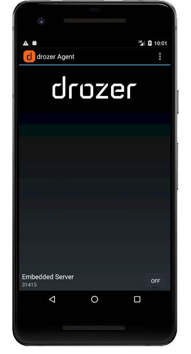

### Drozer Console

1. Download the Drozer package from [here](https://github.com/FSecureLABS/drozer/releases)
2. Follow installation instructions as described [here](https://github.com/FSecureLABS/drozer)
3. Test Drozer installation by running following command in your host machine

        $ drozer

    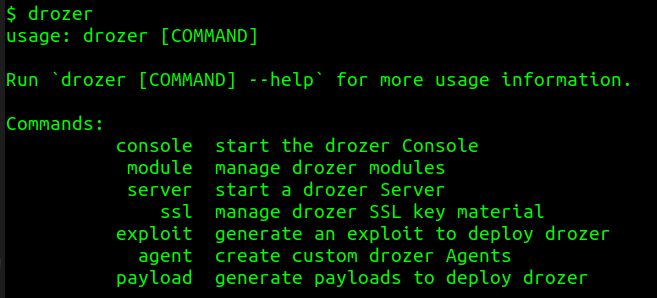

## 2. Start Drozer Server

Switch `ON` the `Embedded Server` in Drozer app

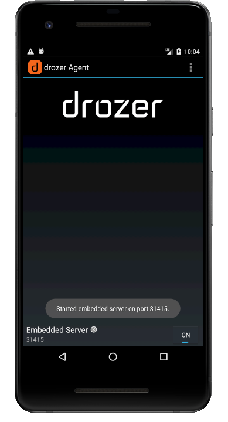

## 3. Connect Drozer Console to Agent

1. In order to allow your host machine to connect to the TCP socket opened by the drozer Agent, run following port forwarding command

        $ adb forward tcp:31415 tcp:31415

    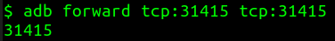

2. Connect drozer Console to the Agent by running following command

        $ drozer console connect

    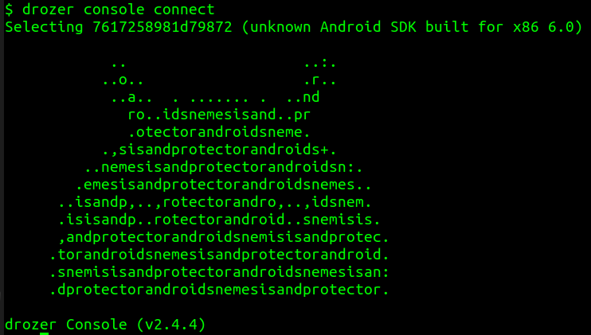

    *Note:* To connect to a real mobile device, run following command 

        $ drozer console connect --server <SERVER_IP_ADDRESS>

## 4. Common Drozer Commands

1. To see a list of available drozer modules

        dz> l

    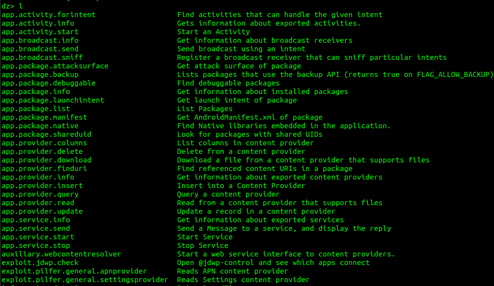

2. To learn about the uasage of a specific drozer module

        dz> help <DROZER_MODULE_NAME>

    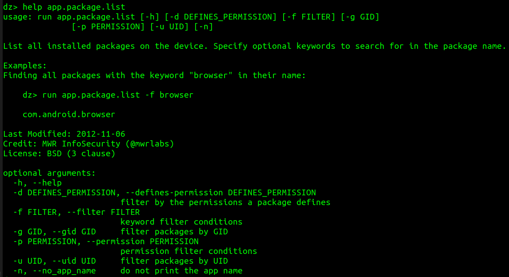

3. Apps installed on an Android device are uniquely identified by their **package name**. Run following command to identify the package name of an app based on keyword search

        dz> run app.package.list -f vyapi

    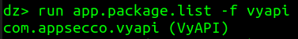

4. To identify the attack surface

        dz> run app.package.attacksurface com.appsecco.vyapi

    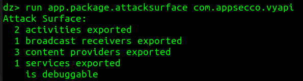

5. To obtain information about **activities**

        dz> run app.activity.info -a com.appsecco.vyapi

6. To obtain information about **broadcast receivers**

        dz> run app.broadcast.info -a com.appsecco.vyapi

7. To obtain information about **content providers**

        dz> run app.provider.info -a com.appsecco.vyapi

8. To obtain information about **services**

        dz> run app.service.info -a com.appsecco.vyapi

9. To start an activity

        dz> run app.activity.start --component com.appsecco.vyapi com.appsecco.vyapi.MainActivity

    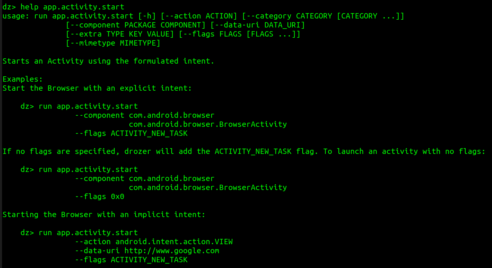

10. To start a service

        dz> run app.service.start --component com.appsecco.vyapi com.appsecco.vyapi.service.PlayMusicService

    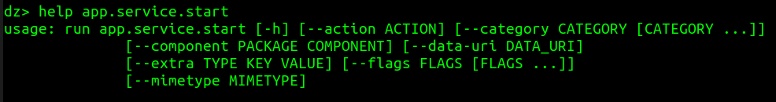   

    *Note:* You can also stop a running service by using a slightly different command

11. To send an **intent** to broadcast receivers

        dz> run app.broadcast.send --action com.appsecco.vyapi.Broadcast --extra string new_file_name newFilename.txt --extra string temp_file_path /tmp/oldFilename.txt

    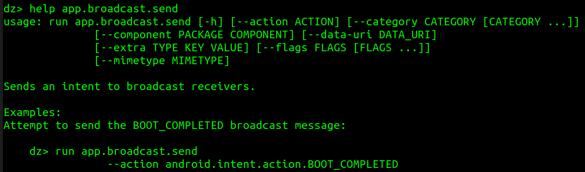

12. To find referenced **content URIs** in a package

        dz> run app.provider.finduri com.appsecco.vyapi

    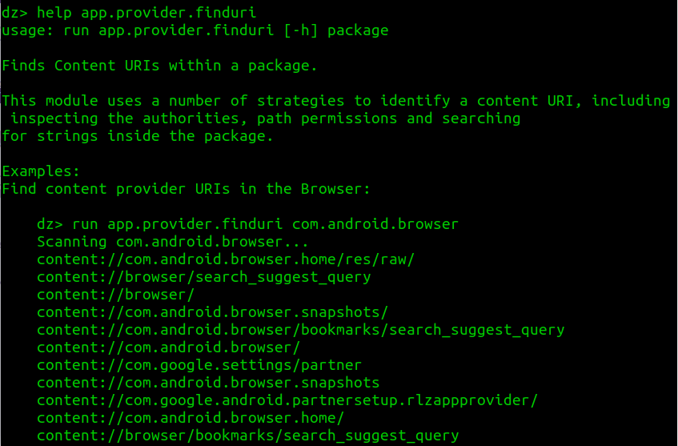

13. To test content providers for **SQL injection** vulnerabilities

        dz> run scanner.provider.injection -a com.appsecco.vyapi

    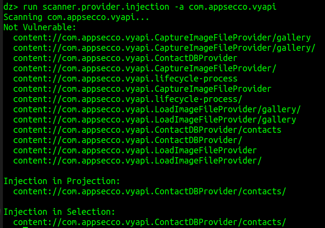

14. To find **tables** accessible through SQL injection vulnerabilities

        dz> run scanner.provider.sqltables -a com.appsecco.vyapi

    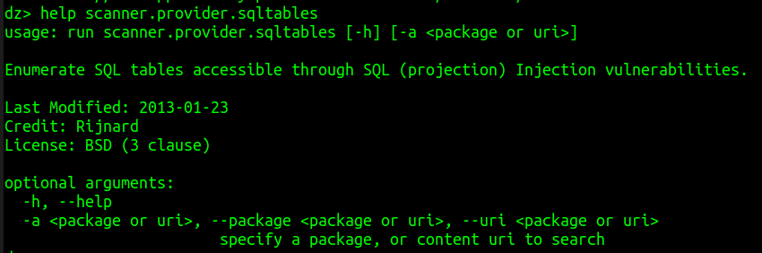

15. To test content providers for basic directory traversal vulnerabilities

        dz> run scanner.provider.traversal -a com.appsecco.vyapi

    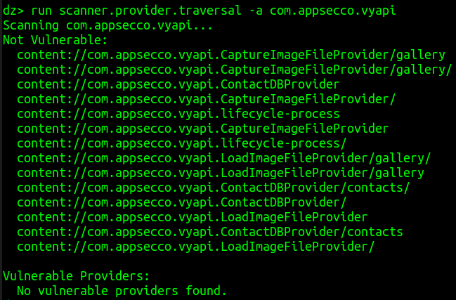

## 5. Solve It

> **EXERCISE-6:**
> 1. Use `app.provider.query` drozer module to **extract data** stored in the SQLite database table named as `contacts_table`
> *Note:* Visit [this link](https://slides.com/riddhishreechaurasia/null-bangalore-vyapi/fullscreen#/4/4) for a hint
> 2. Do you think VyAPI is vulnerable to **path traversal** attack? If yes, how would you exploit it? If no, why?
> *Note:* Visit [this link](https://slides.com/riddhishreechaurasia/null-bangalore-vyapi/fullscreen#/4/17) for a hint

## References

* [https://github.com/mwrlabs/drozer/releases/download/2.3.4/drozer-agent-2.3.4.apk](https://github.com/mwrlabs/drozer/releases/download/2.3.4/drozer-agent-2.3.4.apk)
* [https://github.com/FSecureLABS/drozer](https://github.com/FSecureLABS/drozer)