# Setup VyAPI - A Modern (as per 2019) Cloud Based Vulnerable Android App

- [Setup VyAPI - A Modern (as per 2019) Cloud Based Vulnerable Android App](#setup-vyapi---a-modern-as-per-2019-cloud-based-vulnerable-android-app)
  - [1. Meet Software Prerequisites](#1-meet-software-prerequisites)
  - [2. Configure the Amplify CLI](#2-configure-the-amplify-cli)
  - [3. Create a User Pool using Amplify CLI](#3-create-a-user-pool-using-amplify-cli)
  - [4. Build VyAPI APK](#4-build-vyapi-apk)
  - [5. Create an Android Virtual Device](#5-create-an-android-virtual-device)
  - [6. Install and Run VyAPI](#6-install-and-run-vyapi)
  - [7. Create New Account and Login](#7-create-new-account-and-login)
  - [References](#references)

## 1. Meet Software Prerequisites 

Follow the `Prerequisites` section of [VyAPI GitHub repository](https://github.com/appsecco/VyAPI) to ensure all required softwares are installed in your laptop. You should be ready to use the following 

1. Amplify CLI
2. AWS CLI
3. Android Studio

## 2. Configure the Amplify CLI

1. Run following command in a terminal window

        amplify configure

    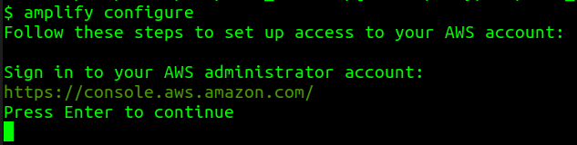

2. Enter *AWS admin credentials* when prompted

    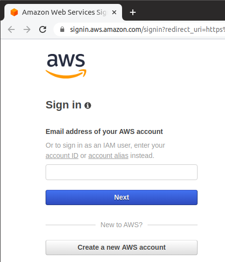

3. Ensure successful login into the `AWS Management Console`

    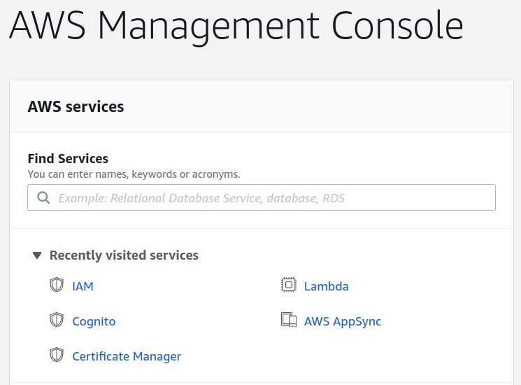

4. Press `Enter` in your terminal window

    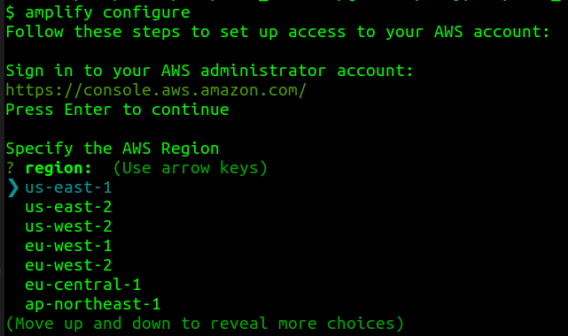

5. Follow on-screen instructions
   1. Select a `region`
   2. Provide a `username` for the new IAM user

        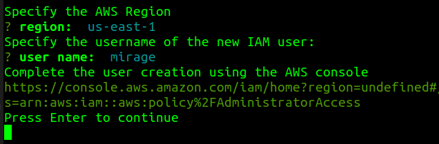

   3. Complete the user creation using the AWS console

        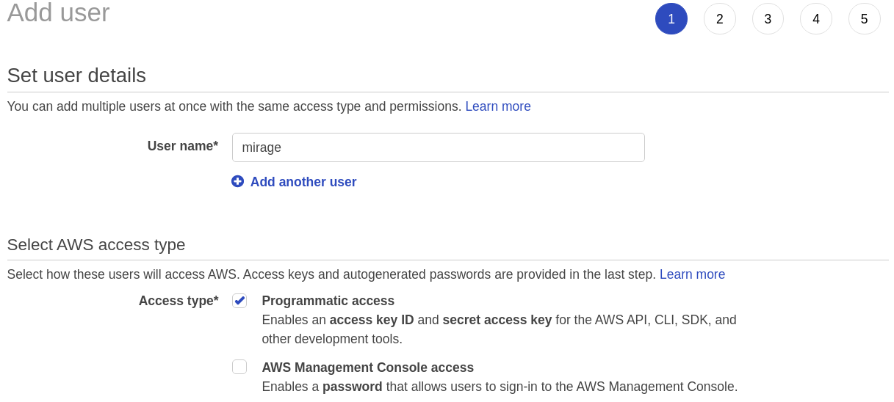

        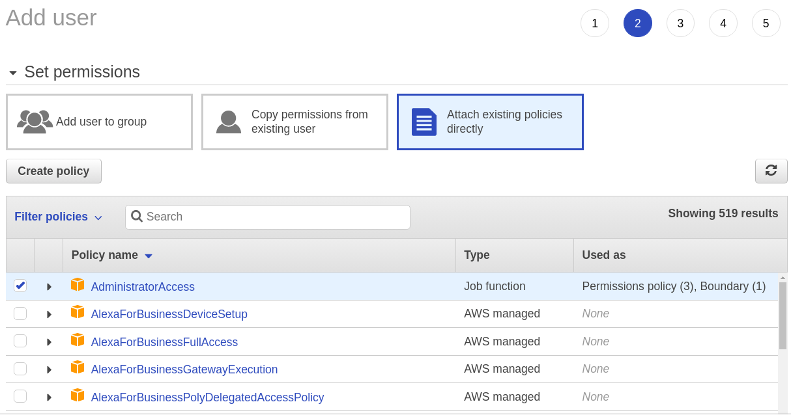

        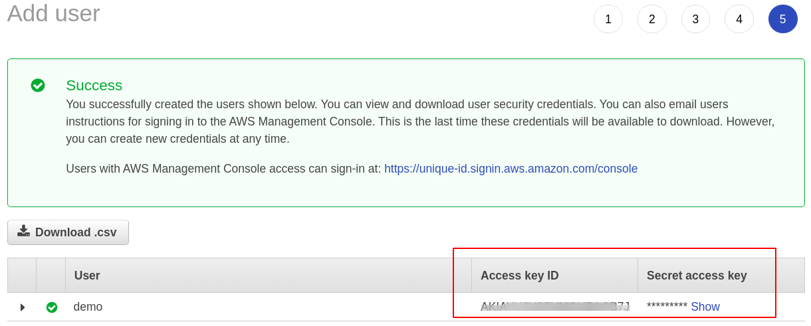

6. Press `Enter` in your terminal window

    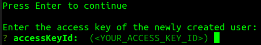

7. Enter the user security credentials as obtained in step #7.3 (see above)
8.  Enter a name for your new AWS Profile

    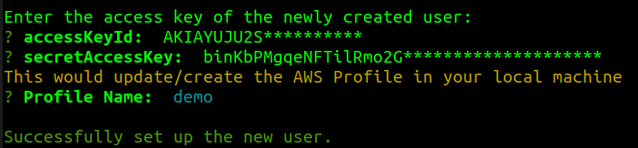

9.  You should see your new IAM user in the AWS console (`Identity and Access Management (IAM)` > `Users`)

    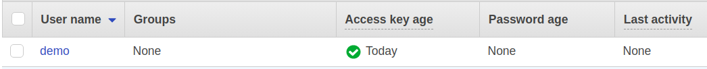

## 3. Create a User Pool using Amplify CLI

By executing below steps, we will build the user **sign-up** and **sign-in** features into our Android app. Amplify CLI will allow us to customize the auth flow for our app.

1. Clone the VyAPI GitHub repository

        git clone git@github.com:appsecco/VyAPI.git

2. Enter `VyAPI` folder

        cd VyAPI/

3. Run following command to **initialize the project** to work with *Amplify CLI*

        amplify init

4. Follow the on-screen instructions

    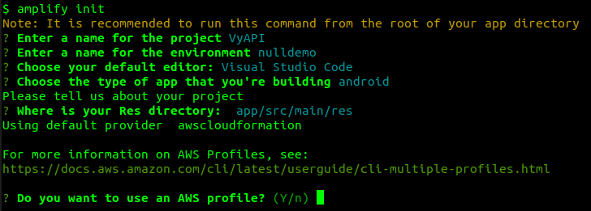

5. When asked to choose an AWS profile, choose the profile that was created earlier in step #8 of previous section (i.e. `Configure the Amplify CLI`)

    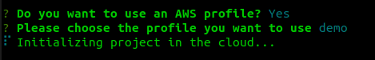
6. Add authentication resource in your local backend

        amplify add auth

    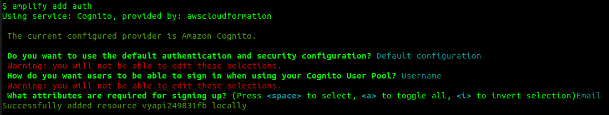

7. Run the following command and ensure that **unauthenticated logins** are allowed

        amplify auth update

    

    Options selected are:

    1. Walkthrough all the auth configurations
    2. User Sign-Up, Sign-In, connected with AWS IAM controls (Enables per-user Storage features for images or other content, Analytics, and more)
    3. Allow unauthenticated logins? - **Yes**
    4. Do you want to enable 3rd party authentication providers in your identity pool? - **No**
    5. Do you want to use an OAuth flow? - **No**

    *Note:* For options not listed above, you can choose to go with the default values.

8.  Check the state of local resources not yet pushed to the cloud

        amplify status
    
    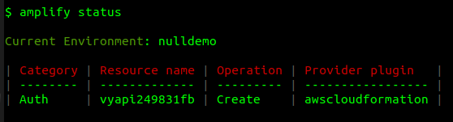
9.  Push the local changes to cloud

        amplify push

    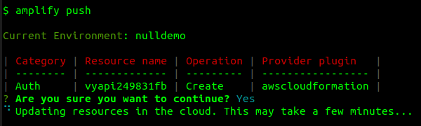

    *Note:* Please be patient while this command runs, as it would take a few minutes to complete.

10. In case you see an **error** message similar to 
    
        The runtime parameter of nodejs8.10 is no longer supported for creating or updating AWS Lambda functions. We recommend you use the new runtime (nodejs12.x) while creating or updating functions.

    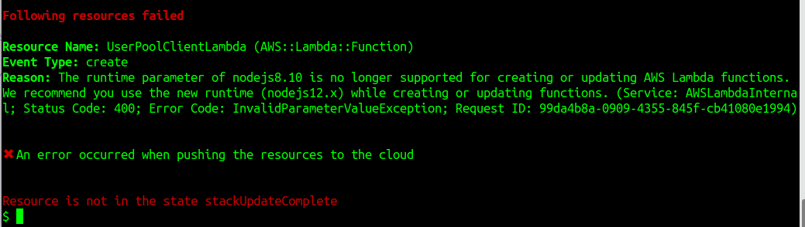
    
    then some troubleshooting is required.

    1. Locate the file that specifies node runtime version

            grep -r -i "nodejs" ./

        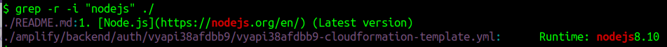

    2. Do a global string replacement of `nodejs8.10` to `nodejs12.x` in the identified template file

            sed -i 's/nodejs8.10/nodejs12.x/g' ./auth/vyapi38afdbb9/vyapi38afdbb9-cloudformation-template.yml
    
    3. Push the local changes to cloud

            amplify push

        

    4. This time you should see the success message `All resources are updated in the cloud`

        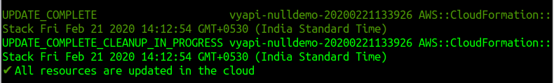

## 4. Build VyAPI APK

1. Open the VyAPI project in **Android Studio**

    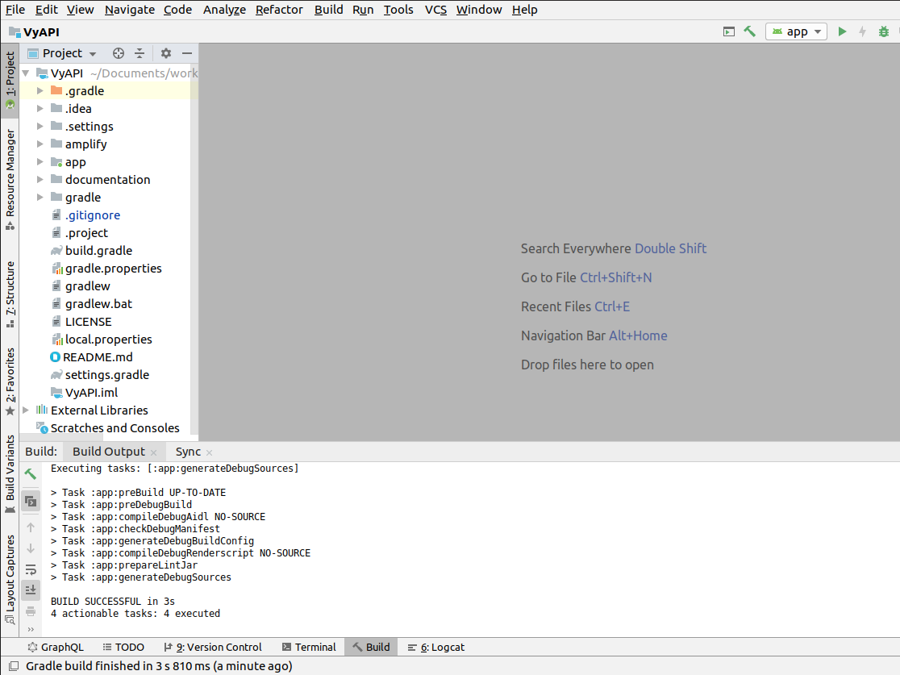

2. Generate the VyAPI APK by selecting `Build Bundle(s)/ APK(s)` -> `Build APK(s)` in *Android Studio*

    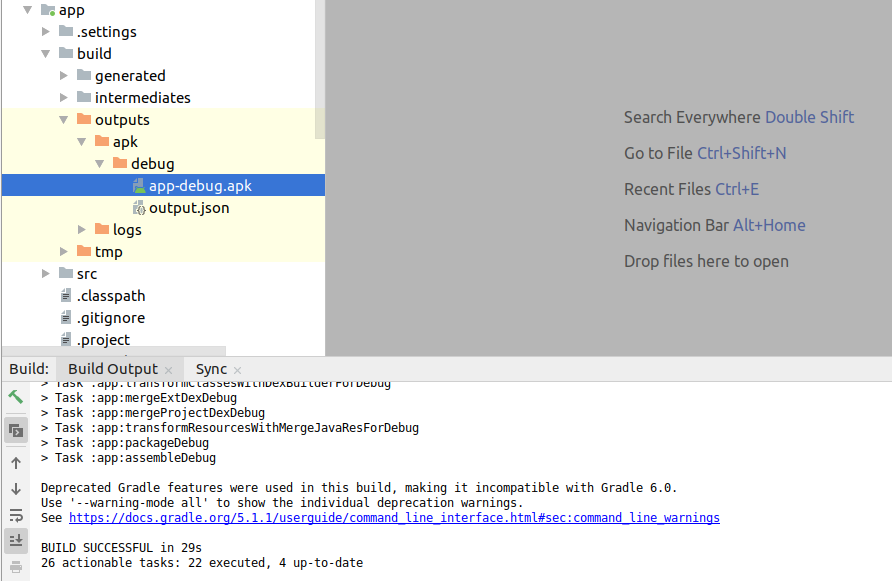

3.  Obtain the VyAPI APK from the relative path `VyAPI/app/build/outputs/apk/debug/app-debug.apk`

## 5. Create an Android Virtual Device

1. In **Android Studio**, click on the `AVD Manager` icon

    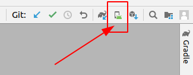

2. Follow steps mentioned [here](https://developer.android.com/studio/run/managing-avds) to create a new virtual device.

    *Note:* Below image shows the configuration that was used at the time of VyAPI development

    

3. Launch the selected AVD in Android emulator

    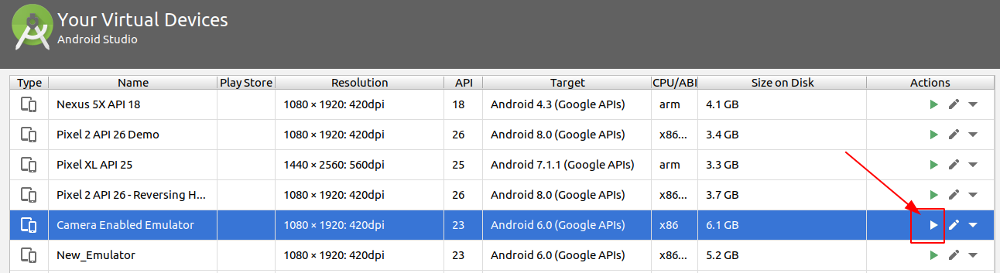
    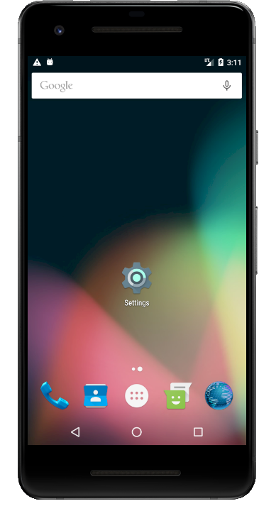

## 6. Install and Run VyAPI

1. Install the VyAPI APK into the Android Emulator by running following command

        adb install /path/to/app-debug.apk

    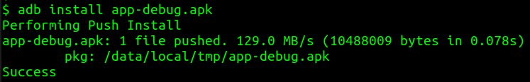

2. Start the Android app by clicking on the VyAPI icon in Android emulator

    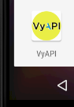

3. You should see the `Sign-in` screen
   
    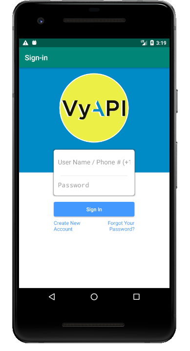

## 7. Create New Account and Login

1. Start the VyAPI app to see **Amazon Cognito** login screen
2. Click on the `Create New Account` button and fill user registration form
   1. Enter a valid email ID
   2. Enter 10 digit phone number preceded by plus symbol and two-digit country code (e.g., +915544332211)
   3. Confirmation code would be sent to your registered email address
3. Retrieve the confirmation code from your inbox
4. Paste the confirmation code into the `Confirmation code` input box of **Confirm your account** page
5. Wait for the **Sign up confirmation succeeded** message to show up
6. Login with the registered username and password
7. On successful login, you would see the empty contacts page

Note: For detailed steps (with screenshots), refer the `Getting Started` section in [VyAPI GitHub repository](https://github.com/appsecco/VyAPI/blob/master/README.md)

## References

* [https://aws-amplify.github.io/docs/cli/lambda-node-version-update](https://aws-amplify.github.io/docs/cli/lambda-node-version-update)
* [https://www.howtoforge.com/tutorial/linux-grep-command/](https://www.howtoforge.com/tutorial/linux-grep-command/)
* [https://www.cyberciti.biz/faq/how-to-use-sed-to-find-and-replace-text-in-files-in-linux-unix-shell/](https://www.cyberciti.biz/faq/how-to-use-sed-to-find-and-replace-text-in-files-in-linux-unix-shell/)