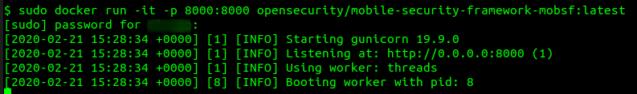
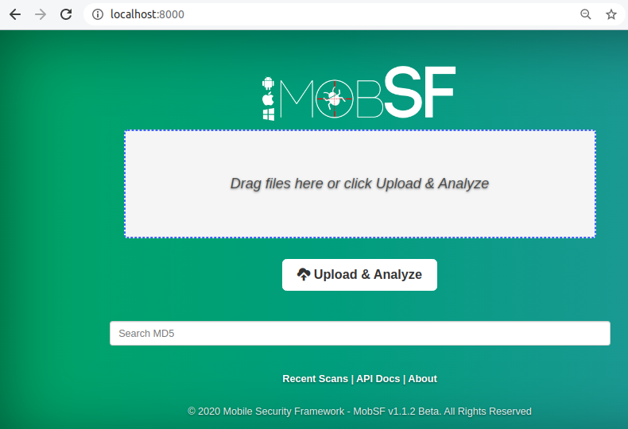
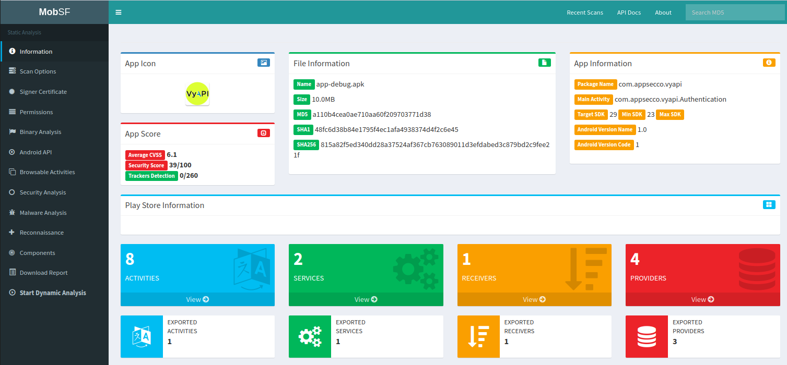

# MobSF

- [MobSF](#mobsf)
  - [1. Installation](#1-installation)
  - [2. Static Analysis using MobSF](#2-static-analysis-using-mobsf)
  - [3. Solve It](#3-solve-it)
  - [References](#references)

## 1. Installation

1. If you have Docker installed in your system, run the following command

        $ sudo docker run -it -p 8000:8000 opensecurity/mobile-security-framework-mobsf:latest

    

2. Otherwise, follow the steps as mentioned [here](https://github.com/MobSF/Mobile-Security-Framework-MobSF/wiki/1.-Documentation) to install and run MobSF
3. Access MobSF web interface by navigating to `http://localhost:8000`

    

## 2. Static Analysis using MobSF

1. Upload an APK file 
2. Wait while MobSF analyzes the APK
3. Do a manual analysis of MobSF report

    

## 3. Solve It 

> **EXERCISE-5:**
> 1. Perform a static analysis of VyAPI APK using MobSF
> 2. Make a note of interesting findings 

## References

* [https://github.com/MobSF/Mobile-Security-Framework-MobSF/wiki/1.-Documentation](https://github.com/MobSF/Mobile-Security-Framework-MobSF/wiki/1.-Documentation)

