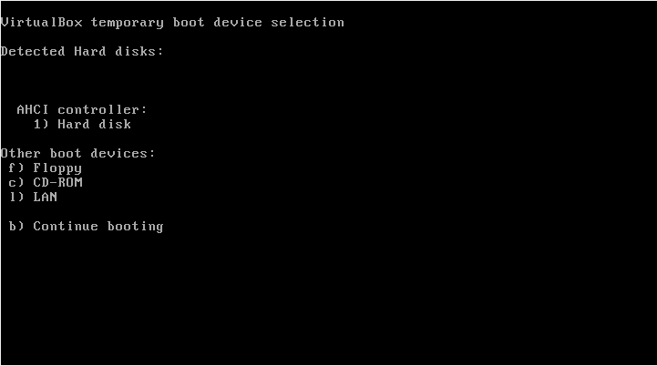

# 1. Basic Input/Output System (BIOS)

After a system powers up, the BIOS (*Basic Input/Output System*) does minimal hardware initialization and hands over control to the boot loader
.
1. Start [Ubuntu](../../prerequisites/README.md)

    

2. Press [`Fn`] + [`F12`] key combination to see a list of boot devices to select from

    

3. Press the key [`B`] on your keyboard to continue booting

4. BIOS is programmed to look at a permanent location on the hard disk, called `boot sector`, to complete its task. Boot sector is the first sector of your hard disk, and is called as MBR (Master Boot Record)
5. As soon as BIOS finds a valid MBR, it will load the entire content of MBR to RAM, and then further execution is done by the content of MBR.