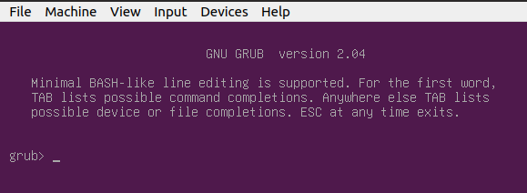
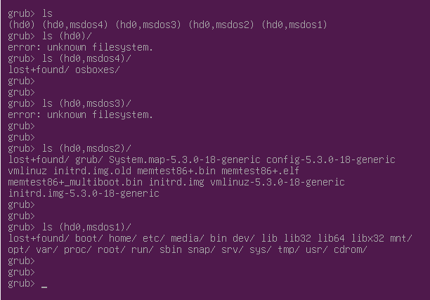

# 3. Grand Unified Bootloader (GRUB)

Grand Unified Bootloader (GRUB) displays a splash screen, waits for few seconds, and loads the default kernel image as specified in the grub configuration file.

If you have multiple kernel images installed on your system, you can choose which one to be executed by using the up- and down-arrow keys to navigate through the menu. Select your desired entry by pressing `ENTER` key. 

GRUB will load the kernel and initial RAM disk before passing control of the computer to the kernel.

GRUB has the knowledge of the filesystem. One problem that can motivate use of GRUB's command line is *GRUB's inability to locate its own configuration file*.

1. In GRUB menu selection screen, press the key [`C`] on your keyboard to access GRUB console

    

2. Identify the partition on which GRUB is installed
   1. Use `ls` to display the disks and partitions that GRUB can detect

        

    2. Look inside particular partitions by specifying the device's name with a trailing slash (/), e.g. `ls (hd0)/`

        

        *Note:* In the current example, a GRUB configuration directory (`grub/`) is visible in `(hd0,msdos2)` partition

 3. With the home of the GRUB configuration file identified, set the `prefix` and `root` environment variables. These variables identify, respectively, the directory in which `grub.cfg` lives and the partition on which it resides:

        grub> set prefix=(hd0,msdos2)/grub
        grub> set root=(hd0,msdos2)

    

 4. Load the `normal` module

         grub> insmod normal

     

 5. Launch `normal` module to bring up the GRUB menu

         grub> normal

     