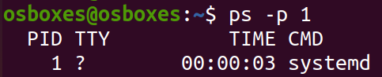
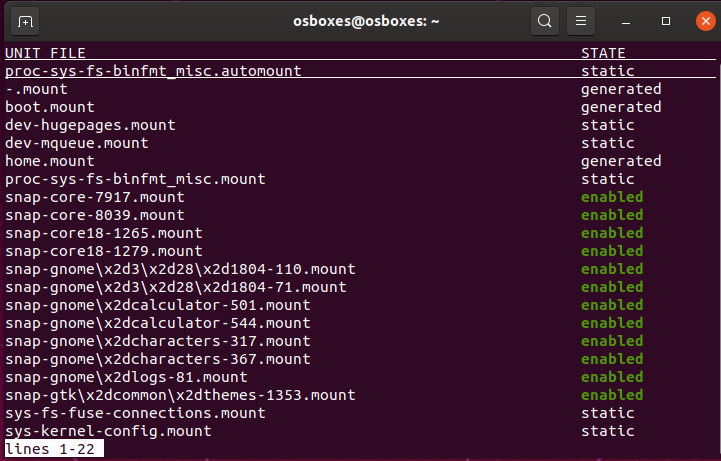
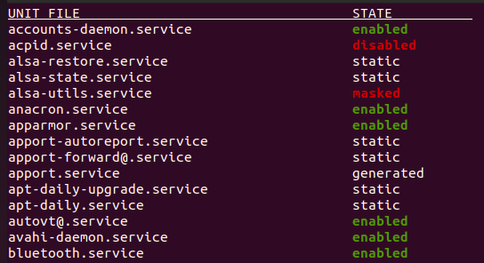
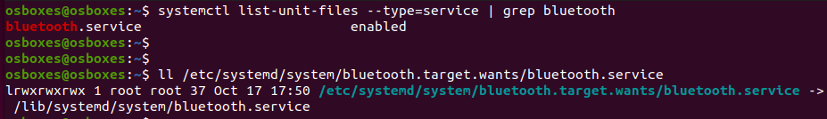
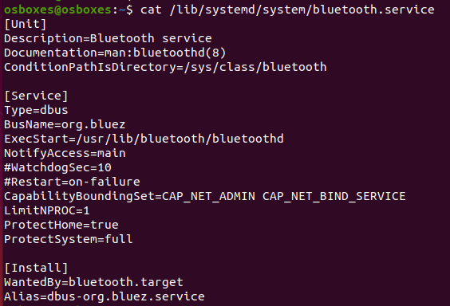
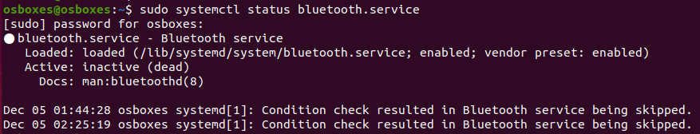
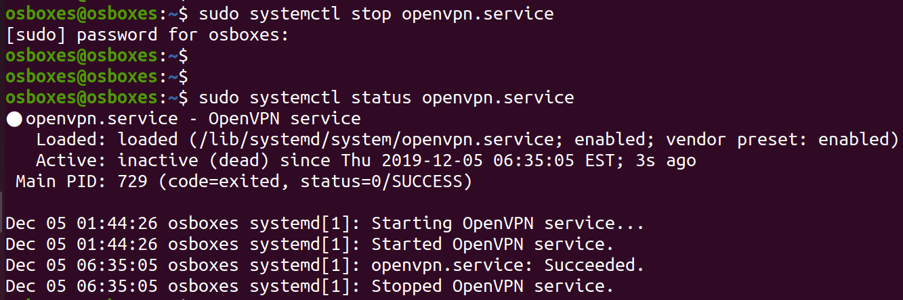
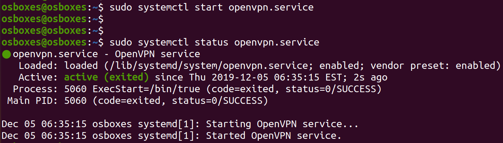

# 5. Init

`init` is the first process that starts when a computer boots, making it the parent of all other running processes directly or indirectly.

`systemd` stands for *system daemon*, and it is a modern init system for Linux. 

After the kernel is booted and initialized, it begins the systemd initialization system. The first user-space application, known as `init`, is called. As it is the 1st program to be executed by Linux Kernel, it has the process id (PID) of `1`. 

1. Check the process ID of `init`

        $ ps -ef | grep init

    

2. Find out if your system is using `SysV`, `Upstart` or `Systemd` based *init*

        $ ps -p 1

    

3. We found `systemd` init script running in our machine, and hopefully (if you aren't using an older version of Linux operating system), all of us should see a similar output. A few interesting facts about it are:

    * `systemd` renames itself to `init` at boot time
    * It works as a *system and service manager* for Linux, and, controls what programs run when a Linux system boots up
    * `systemd` introduces the concept of **systemd units** (i.e., *service unit*, *mount unit*, *socket unit*, *target unit*, etc.)
    * It looks for system unit files in following order
      * `/etc/systemd/system`
      * `/run/systemd/system`
      * `/usr/lib/systemd/system`
    * In user context, the order of precedence for unit files is
      * `/etc/systemd/user`
      * `/run/systemd/user`
      * `/usr/lib/systemd/user`

4. To see a list of all the unit files installed on the system, run this command

        $ systemctl list-unit-files

    

5. The two most common units for system owners to deal with are *service units* and *target units*.

        $ systemctl list-unit-files --type service

    

        $ systemctl list-unit-files --type target

    

6. *Service unit* describes a process that `systemd` can start and monitor

    **Syntax:**

        $ sudo systemctl [command] NAME.service

7. Locate *bluetooth* service unit file

        $ systemctl list-unit-files --type=service | grep bluetooth
        $ ll /etc/systemd/system/bluetooth.target.wants/bluetooth.service

    

8. View the contents of *bluetooth* service unit file

        $ cat /lib/systemd/system/bluetooth.service

    

    Notice the *ExecStart* option. It tells us that the bluetooth service unit would run the *bluetoothd* daemon when started.

9. Check the status of `bluetooth.service` unit

        $ sudo systemctl status bluetooth.service

    

10. Check the status of `openvpn.service` unit

        $ sudo systemctl status openvpn.service

    

11. Stop the *openvpn* service

        $ sudo systemctl stop openvpn.service

    

12. Start the *openvpn* service

        $ sudo systemctl start openvpn.service

    
