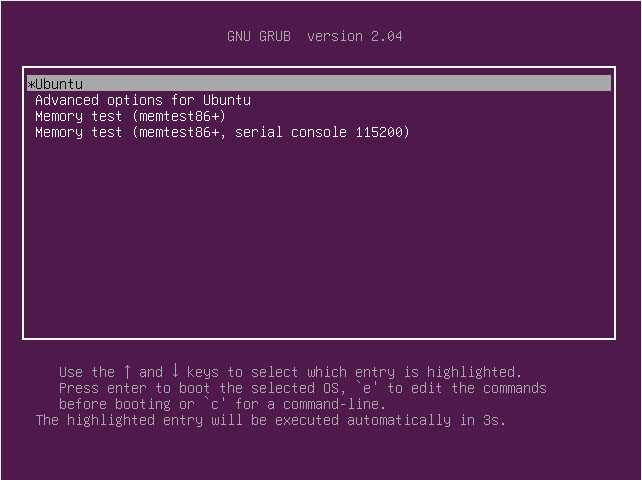
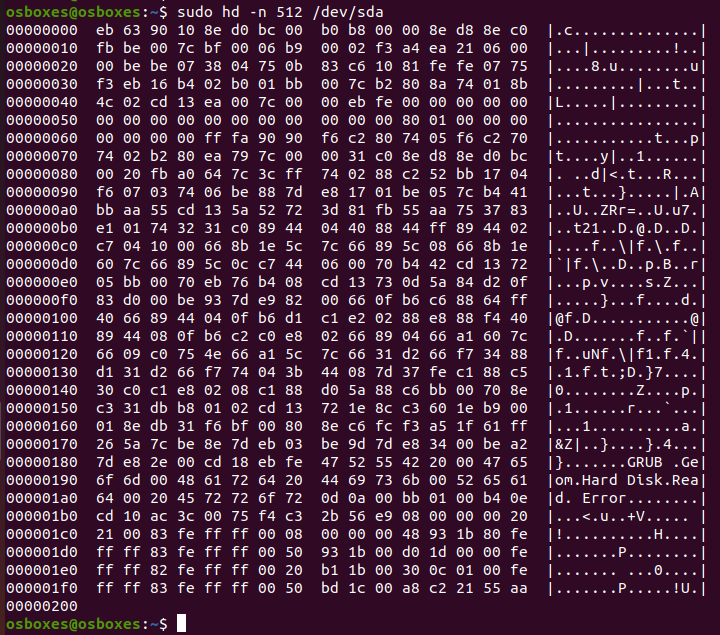

# 2. Master Boot Record (MBR)

Master Boot Record (MBR) is located in the 1st sector of the bootable disk, which is typically `/dev/hda`, or, `/dev/sda`. This is the location that contains the program that will help our computer to load the operating system.

MBR loads and executes the GRUB boot loader.

1. Run following command in a terminal to see the hexdump of MBR:

        $ sudo hd -n 512 /dev/sda

    

2. Notice that the last two bytes are `55` and `aa` respectively - this will be present as the last two bytes of the MBR for all **little-endian systems**, like `x86`. The last two bytes will be *reversed*, i.e., `aa` then `55`, for **big-endian systems**. 
   
    *Note:* If you don't see this, you aren't looking at the master boot record.