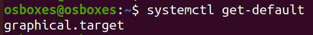
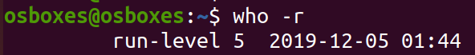
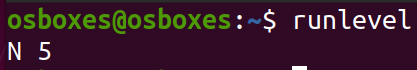
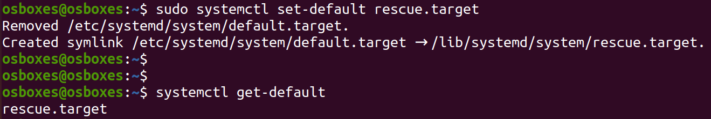
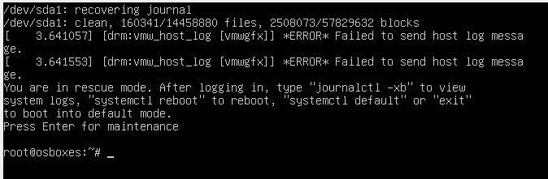

# 6. Runlevel

The current operating state of an operating system is known as a *runlevel*. In `systemd`, **targets** are the new *runlevels*. 

The different *targets* are:

1. `poweroff.target` ==> runlevel 0 ==> Shutdown and power off the system]
2. `rescue.target` ==> runlevel 1 ==> Launch the rescue shell session
3. `multi-user.target` ==> runlevel 2,3,4 ==> Set the system in non-graphical (console) multi-user system
4. `graphical.target` ==> runlevel 5 ==> Use a graphical multi-user system with network services
5. `reboot.target` ==> runlevel 6 ==> Shutdown and reboot the system

A **systemd target** defines the *state* a system should be in, and the processes and services that should be started to get into that state.

1. View the *default* target of your system

        $ systemctl get-default

    

2. View the *current* runlevel

        $ who -r

    

3. View the *previous* and *current* runlevels

        $ runlevel

    

    *Note:* In the above output, the letter `N` indicates that the runlevel has not been changed since the system was booted. And, `5` is the current runlevel i.e the system is in GUI mode.
     

4. Change the *current* target

        $ sudo systemctl isolate poweroff.target

5. Change the *default* target

        $ sudo systemctl set-default rescue.target

    

    After a system *reboot*, you will see a message indicating that you are in *rescue* mode. The default user in rescue mode will be *root*.

    
