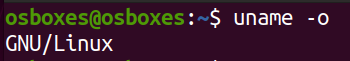
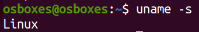

# Getting started with Linux

## GNU/Linux

**GNU** stands for *GNU Not Unix*. It was designed to be an open source *operating system* that is backwards compatible with Unix operating systems. GNU packages are packages designed to be shared, modified and run wherever you want, for whatever purpose.

1. Find out what operating system is running in your machine

        $ uname -o

    

2. Print the kernel name

        $ uname -s

    

3. Follow [this link](https://www.geeksforgeeks.org/uname-command-in-linux-with-examples/) and try other available `uname` options.

## Linux Software Repositories

On Linux, software is distributed through software repositories.

1. Adding custom APT repositories

## Package Management

On Linux, packages are downloaded and installed from online repositories by a package manager.

https://www.linode.com/docs/tools-reference/linux-package-management/#advanced-packaging-tool-apt
https://devconnected.com/apt-package-manager-on-linux-explained/

1. Advanced Packaging Tool (APT)

    `apt-get` is a command which uses the advanced packaging tool to interact with the operating system’s package system.

2. APT Cache

3. Using dpkg

4. Updating (upgrading) your local packages

5. Installing new packages

   1. From Ubuntu repository
   2. From .deb
   3. From .tar
   4. From PPA

6. Uninstalling packages

7. Purging packages

8. Removing dangling dependencies

9.  The terminal
   1. Setting up root password
   2. Switching users
   3. Disabling root account
   4. ~~Updating the system~~
   5. Sudo
   6. ~~Package installation~~
      1. ~~From Ubuntu repository~~
      2. ~~From .deb~~
      3. ~~From .tar~~
      4. ~~From PPA~~
   7. Basic commands
      1. cd
      2. pwd
      3. ls
      4. man
      5. info
      6. whoami
      7. mkdir
      8. rmdir
      9. cp
      10. mv
      11. rm
      12. aplay
      13. kill
      14. killall
      15. nano
      16. vi/vim
      17. screen
      18. history
   8. Keyboard shortcuts
   9.  Linux file system
   10. File permissions
       1.  Change mode
       2.  Change group
       3.  Change owner
       4.  SUID
       5.  SGID
       6.  Sticky bits
   11. Additional commands
       1.  du
       2.  df
       3.  free
       4.  date
       5.  finger
       6.  head
       7.  tail
       8.  locate
       9.  grep
       10. cut
   12. Pipelining
   13. Input & output redirection
   14. Managing device partitions
       1.  fdisk
       2.  mount
   15. Little more on devices
       1.  Device type
       2.  Maor number
       3.  Minor number
       4.  /dev/hda
       5.  /dev/sda
       6.  /dev/tty
       7.  /dev/pts
   16. Running .exe files with Wine
   17. Archiving, compressing and encrypting files
       1.  tar
       2.  zip/unzip
       3.  ccrypt
       4.  gpg
10. Shell
   18. Different types of shells
   19. Declaring variables
   20. Using quotes
   21. Environment variables
   22. Parameter variables
   23. Conditional statements
   24. Functions
11. Email encryption using PGP

## References

* https://devconnected.com/apt-package-manager-on-linux-explained/
* https://www.linode.com/docs/tools-reference/linux-package-management/#advanced-packaging-tool-apt
* https://devconnected.com/apt-package-manager-on-linux-explained/
* https://www.geeksforgeeks.org/uname-command-in-linux-with-examples/
