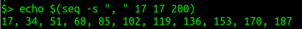
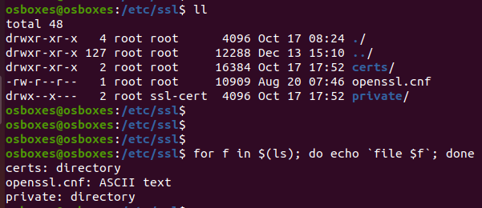
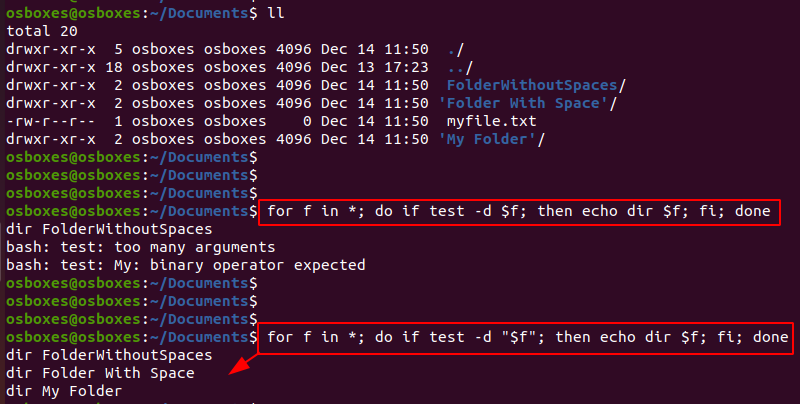

# BASH Shell <!-- omit in toc -->

- [Shell Scripting](#shell-scripting)
- [Examples](#examples)
- [References](#references)

A shell is special user program which provides an interface to the user to use operating system services. It is a command language interpreter that executes commands read from input devices such as keyboards or from files.

**BASH** (*Bourne Again SHell*) is the most widely used shell in Linux systems. It is used as default login shell in Linux systems and in macOS.

## Shell Scripting

1. `#!` is called **shebang**. This tells the operating system that whatever follows the shebang is the interpreter we want to use for our script. To use BASH shell interpreter, we start our bash script with the following line

        #! /bin/bash

2. Create a file called as `hello`
    
    ```bash
    $ vim hello
    ```

3. Paste the following content
   
    ```bash
    #! /bin/bash
    ## This program prints 'Hello Krazy!'
    echo "Hello Krazy!"
    exit 0
    ```

    *Note:* The `exit 0` at last is not necessary but its considered to be a good programming practice to have your script exit appropriately with proper exit codes.

4. Give **execute** permission to the file

    ```bash
    $ chmod 755 hello
    ```

5. Run the bash script

    ```bash
    $ ./hello
    ```
        
    

##  Examples

1. Print multiples of 17, separated by commas, that are less than 200

    ```bash
    echo $(seq -s ", " 17 17 200)
    ```

    

2. Determine the file type for files in your current directory 

    ```bash
    for f in $(ls); do echo `file $f`; done
    ```

    

3. Print only directories

    ```bash
    for f in *; do if test -d "$f"; then echo dir $f; fi; done
    ```

    

    *Note:* Since file and folder names could contain spaces, quote all use of variables that you don’t want split, i.e., use `"$f"` instead of just `$f`

## References

* https://hacker-tools.github.io/shell/
* https://www.gnu.org/software/bash/manual/bash.html