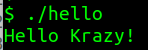

# BASH Shell

A shell is special user program which provides an interface to the user to use operating system services. It is a command language interpreter that executes commands read from input devices such as keyboards or from files.

**BASH** (*Bourne Again SHell*) is the most widely used shell in Linux systems. It is used as default login shell in Linux systems and in macOS.

## Shell Scripting

1. `#!` is called **shebang**. This tells the operating system that whatever follows the shebang is the interpreter we want to use for our script. To use BASH shell interpreter, we start our bash script with the following line

        #! /bin/bash

2. Create a file called as `hello`

        $ vim hello

3. Paste the following content
   
    ```bash
    #! /bin/bash
    echo "Hello Krazy!"
    ```

4. Give **execute** permission to the file

        $ chmod 755 hello

5. Run the bash script

        $ ./hello
        
    


### References

* https://www.gnu.org/software/bash/manual/bash.html