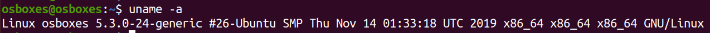

## GNU/Linux

**GNU** stands for *GNU Not Unix*. It was designed to be an open source *operating system* that is backwards compatible with Unix operating systems. GNU packages are packages designed to be shared, modified and run wherever you want, for whatever purpose.

1. Find out what operating system is running in your machine

        $ uname -o

    

2. Print the kernel name

        $ uname -s

    

3. Print all system information. Follow [this link](https://stackoverflow.com/questions/6943803/understanding-uname-output) to understand the output.
   
        $uname -a

    

4. Follow [this link](https://www.geeksforgeeks.org/uname-command-in-linux-with-examples/) and try other available `uname` options.