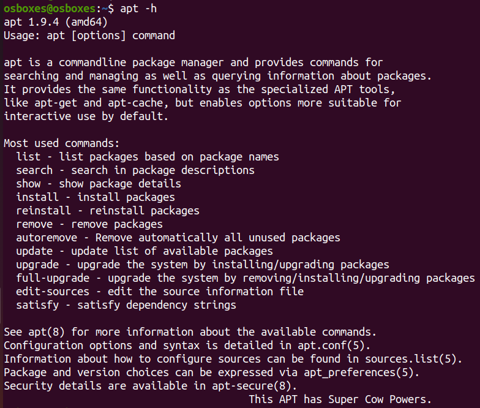
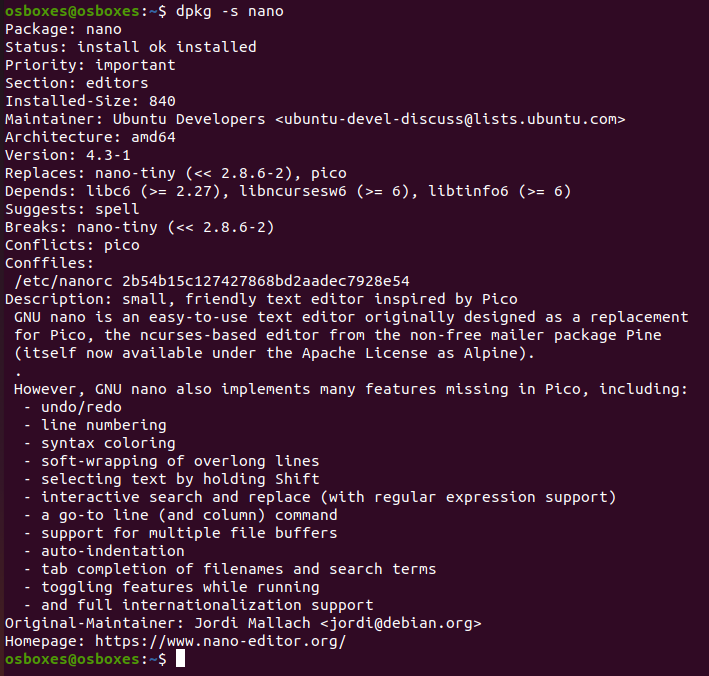

# Package Management <!-- omit in toc -->

- [Advanced Packaging Tool (APT)](#advanced-packaging-tool-apt)
- [View installed packages](#view-installed-packages)
- [Find package](#find-package)
- [Install new package](#install-new-package)
- [Uninstall package](#uninstall-package)
- [Remove dangling dependencies](#remove-dangling-dependencies)

On Linux, packages are downloaded and installed from online repositories by a package manager.

## Advanced Packaging Tool (APT)

The `APT` package provides the `apt` command-line management tool. `apt` is a command which uses the advanced packaging tool to interact with the operating system’s package system.

1. To update the database of available packages, i.e., to allow system to find if a newer version of software is available, run following command

        $ sudo apt update

2. To upgrade the installed packages to their newer versions, run following command

        $ sudo apt upgrade -y

3. To upgrade the system as a whole, i.e., to upgrade packages with auto-handling of dependencies which might involve removing currently installed packages if needed, run following command

        $ apt full-upgrade

4. View all `apt` command line options

        $ apt -h

    

## View installed packages

1. List all installed packages 
   
        $ apt list --installed
        $ dpkg -l

2. Check if a specific package is installed or not

        $ dpkg -s <PACKAGE_NAME>
        $ dpkg -s nano

    

3. List all files installed by a specific package

        $ dpkg -L <PACKAGE_NAME>
        $ dpkg -L nano

4. Find out which package installed a specific file

        $ dpkg -S <FILE_NAME> 
        $ dpkg -S /etc/host.conf 

## Find package

1. Search for a package by keyword

        $ apt search <SEARCH_TERM>
        $ apt search cats

2. See detailed information about a package

        $ apt info chameleon-cursor-theme

## Install new package

1. From *Ubuntu* repository

        $ apt install <PACKAGE_NAME>
        $ apt install firefox

2. From **.deb**

        $ apt install </path/to/deb/file/debfile.deb>

3. From **.tar**

    1. Extract the `.tar` file

            $ tar xvf <PACKAGE_NAME.tar>

    2. Go into the extracted folder

            $ cd <PACKAGE_NAME>

    3. Run following commands

            $ ./configure
            $ make && make install

    *Note:* Most packages get installed in this manner, if it does not then all such packages come with a README or/and INSTALL file that contains all the additional instructions one needs to successfully install the application.

4. From **.tar.gz** 

        $ tar xvfz <PACKAGE_NAME>.tar.gz

5. From **.tar.bz2**

        $ tar xvfj <PACKAGE_NAME>.tar.bz2

6. From Personal Package Archive

        $ sudo apt-add-repository ppa:libreoffice/libreoffice-4-0
        $ sudo apt update
        $ sudo apt-get install <PACKAGE_NAME>
        $ sudo apt-get install libreoffice

## Uninstall package

1. To remove the binaries associated with a package

        $ apt remove <PACKAGE_NAME>
        $ apt remove firefox

2. To remove everything related to a package including the configuration files (useful when you have messed up with the configuration of a program)

        $ apt purge <PACKAGE_NAME>
        $ apt purge firefox

## Remove dangling dependencies

    $ apt autoremove
    $ apt remove firefox --auto-remove