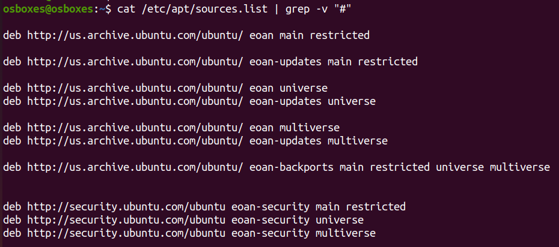
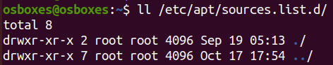

# Software Repositories <!-- omit in toc -->

- [View default repositories](#view-default-repositories)
- [View custom repositories](#view-custom-repositories)
- [Add a custom APT repository](#add-a-custom-apt-repository)

On Linux, software is distributed through software repositories. Sometimes, the default repository might not be sufficient, and we might have to add additional repositories to access additional functionality.

## View default repositories

By default, repositories are stored into the `/etc/apt` folder.

* Find the default set of repositories configured for your distribution

        $ cat /etc/apt/sources.list | grep -v "#"

    

    * **Main** – officially supported, open-source software
    * **Restricted** – officially supported, closed-source software
    * **Universe** – community-maintained, open-source software
    * **Multiverse** – unsupported, closed-source and patent-encumbered software

## View custom repositories

* Locate the custom repositories configured for your distribution by viewing the contents of **sources.list.d** folder

        $ ll /etc/apt/sources.list.d/

    

    *Note:* 
    * `sources.list.d` may contain *custom* APT repositories
    * New repositories could be added by putting a file with a unique name and the same format as `/etc/apt/sources.list` into the **folder** `/etc/apt/sources.list.d`.
    * Names of files in `/etc/sources.list.d` must end in `.list`
    
## Add a custom APT repository

1. Create a file with `.list` extension in `/etc/apt/sources.list.d` folder

        $ sudo touch /etc/apt/sources.list.d/<REPO_NAME>.list

2. Add an entry for the custom repository, e.g., `deb https://packages.grafana.com/oss/deb stable main`, in the newly created file
   
        $ sudo nano /etc/apt/sources.list.d/<REPO_NAME>.list

3. Import GPG keys, if you want to install packages securely

        $ sudo wget -q -O https://packages.grafana.com/gpg.key | sudo apt-key add

4. Update your APT cache in order for the changes to be applied

        $ sudo apt update