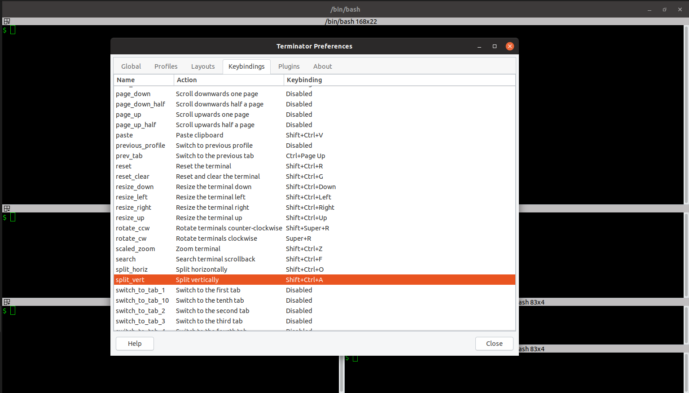

# Terminator - The Terminal Emulator <!-- omit in toc -->

- [Installation](#installation)
- [Key Commands](#key-commands)
- [References](#references)

Terminator is a terminal emulator which supports tabs and multiple resizable terminal panels in one window.

## Installation

1. Locate the `terminator` package
   
        $ apt search terminator
        $ apt info terminator

2. Check if the package is already installed in your system
    
        $ dpkg -s terminator

3. Install `terminator`, if not already installed

        $ sudo apt install terminator

## Key Commands

1. `[Fn]` + `[F11]` Toggle fullscreen
2. `[Ctrl]` + `[Shift]` + `[o]` Split terminals horizontally
3. `[Ctrl]` + `[Shift]` + `[e]` Split terminals vertically
4. `[Ctrl]` + `[Shift]` + `[w]` Close current Panel
5. `[Ctrl]` + `[Shift]` + `[t]` Open new tab
6. `[Ctrl]` + `[Shift]` + `[x]` Maximize/minimize terminal
7. `[Alt]` + `[↑]` Move to the terminal above the current one
8. `[Alt]` + `[↓]` Move to the terminal below the current one
9. `[Alt]` + `[←]` Move to the terminal left of the current one
10. `[Alt]` + `[→]` Move to the terminal right of the current one

*Note:* To change the key bindings, right click anywhere in a terminal window and select `Preferences` from the context menu. Select the `Keybindings` tab. Choose a desired action and press the desired key combination.

## References

* https://wiki.archlinux.org/index.php/Terminator