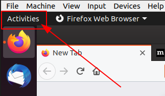
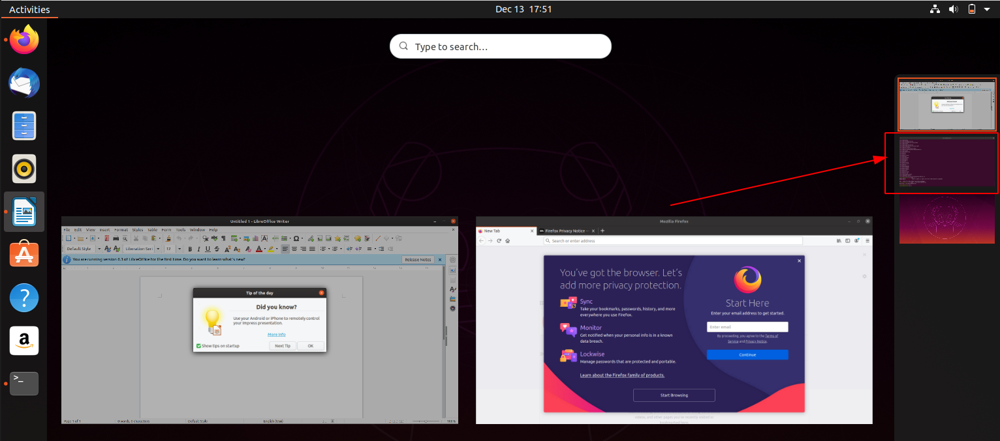

# Workspaces <!-- omit in toc -->

1. On your Ubuntu desktop, click on `Activities` tab

    

2. Drag and drop open windows from the current workspace on top of the workspace selector

    

    

3. Press `[SUPER]` + `[PgUp]`/`[PgDn]` key combination to switch between workspaces 

## References

* https://www.ihaveapc.com/2019/05/how-to-add-workspaces-in-ubuntu-19-04-and-change-the-dock-position/