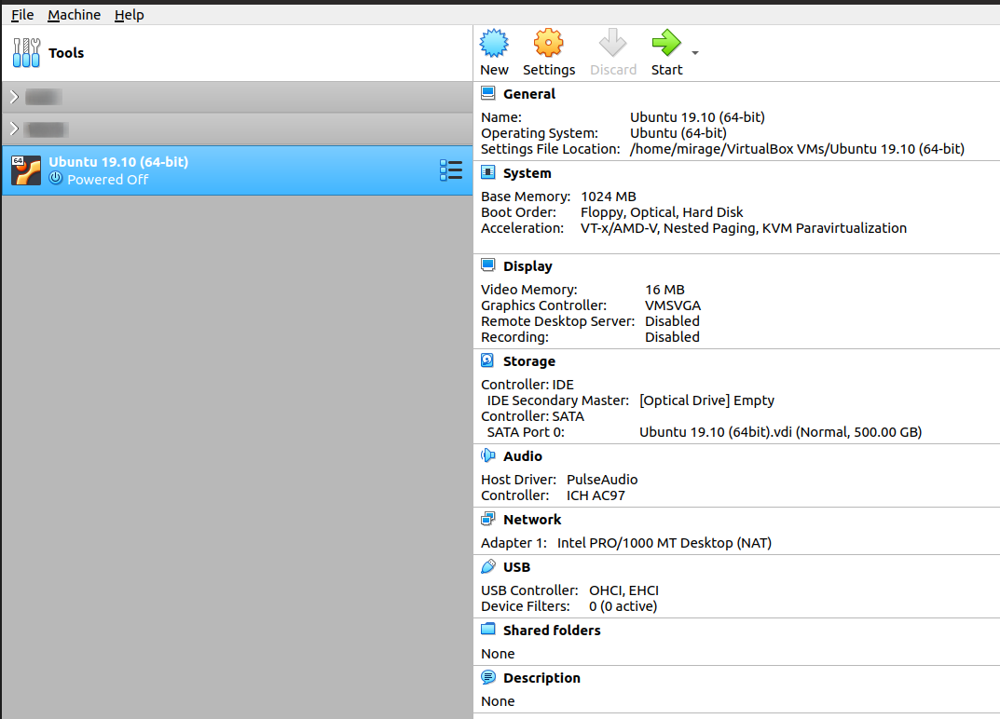

## System Prerequisites

1. Download and install [Xtreme Download Manager](http://xdman.sourceforge.net/)
2. Download (using XDM) and install [VirtualBox](https://www.virtualbox.org/wiki/Downloads)
3. Download [Ubuntu 19.10 VirtualBox image](https://sourceforge.net/projects/osboxes/files/v/vb/55-U-u/19.10/U19_10-VB-64bit.7z/download)
4. Extract `Ubuntu 19.10 (64bit).vdi` file from the downloaded zip file (refer step #3, above)
5. Open VirtualBox 
6. Select `Machine` >> `New` 
7. Give a name to your virtual machine, e.g. `Ubuntu 19.10 (64-bit)`

    

8. Click `Next` and select the memory size.
    
    *Note:* Virtualbox recommends allotting less than half of the total RAM in host machine. For example, if you have a 2 GB RAM you can allot up to 1 GB memory for one virtual machine.

    

9. Select the option `Use an existing virtual hard disk file` and add the extracted `.vdi` file (refer step #4, above)

    

    

10. Click on `Create`

11. Select the newly created virtual machine (VM) `Ubuntu 19.10 (64-bit)` and click on `Start`

    

12. Login using the password `osboxes.org`

    

